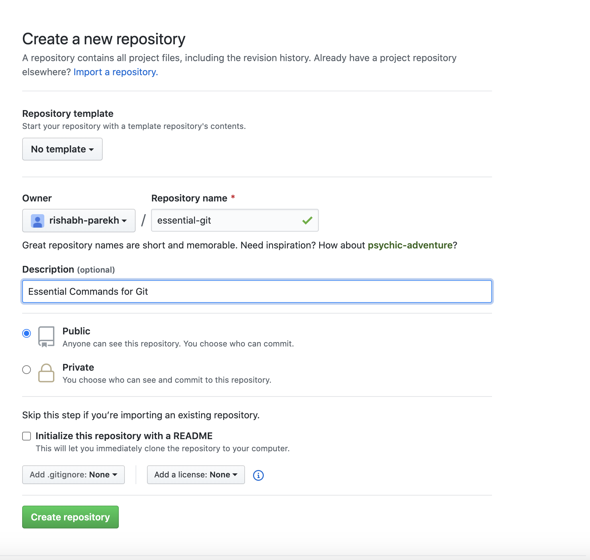
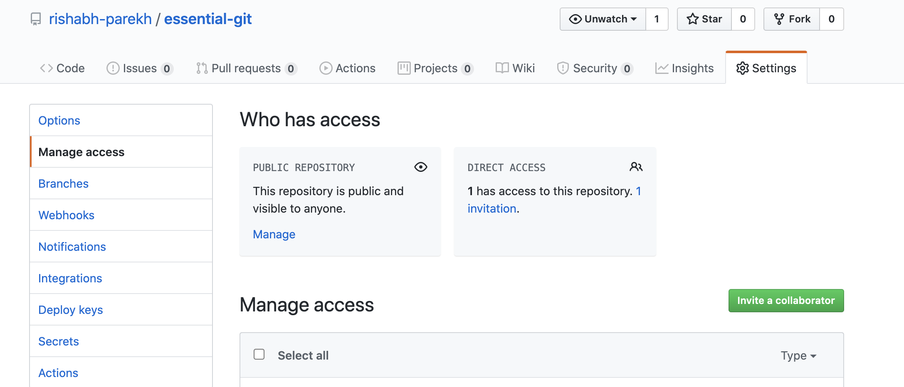

# Introduction
These are some useful git commands to get started to use git. 


1. Start a new project locally

    `git init`

    The output is: `Initialized empty Git repository in /Users/rishabhparekh/code/essential-git/.git/`

2. Add files to the repo locally. 

```bash
  git remote add origin git@rishabh:rishabh-parekh/essential-git.git
  git add *
```

3. Create a remote (github) repo

  Go to the browser, http://www.github.com and create a new repo

  

4. Connect Remote to local

```bash
  git remote add origin git@rishabh:rishabh-parekh/essential-git.git
```

5. Upload changes from local to github

    Every time I make changes, I can commit and push. 

```bash
  git commit -am “Initial Readme and images committed”
  git push origin master
```

6. If someone else makes a change and I want to accesss it

      `git pull origin master`

7. How to check the status

```bash
  git status (for local status)
  git fetch update (for remote status)
```


8. How to connect existing local repo to remote repo

```bash
  git remote set-url origin git@rishabh:rishabh-parekh/dh101assignments.git 
  git remote -v 
  git add *
  git commit -am "Changes to Assignment"
  git push -u origin master
```

9. Once you are ready to upload your changes from local to remote

```bash
  git commit -am "<< Description of the changes>>"
  git push origin master
```

10. Pull Request

    When you want to collaborate with your team, make sure you add them as collaborates on your git repo and allow them to commit. 

  

  Next the collaborater, accepts the invite and they are now ready to commit code. 
  
  
  For pull request first create a feature branch, for a feature you are working. 


```bash
  git commit -am "<< Description of the changes>>"
  git checkout -b pull-request-demo
```

  Commit your changes and now you are ready to create a PR. 

    git commit -am "Pull Request Steps"
  
  Push your changes to the branch pull-request-demo

    git push origin pull-request-demo


11. Fetch from Remote and Rebase

  If you have a remote repo which is your original repo, and you want to fetch changes from the original repo, and at the same time over ride you local changes on top of it. 

  Add the upstream which is one time. 

    git remote add upstream https://github.com/dlab-berkeley/DIGHUM101-2020

  You if you have made local changes, first commit them

    git commit -am "Saving local changes"
    git push origin master

  Then, every time you want to pull code from remote Evans: (like "git pull" which is fetch + merge)

    git fetch upstream
    git merge upstream/master master

  Or, better, replay your local work on top of the fetched branch
  like a "git pull --rebase"

    git rebase upstream/master

  You can do all this in one command, 

    git pull upstream master --rebase
